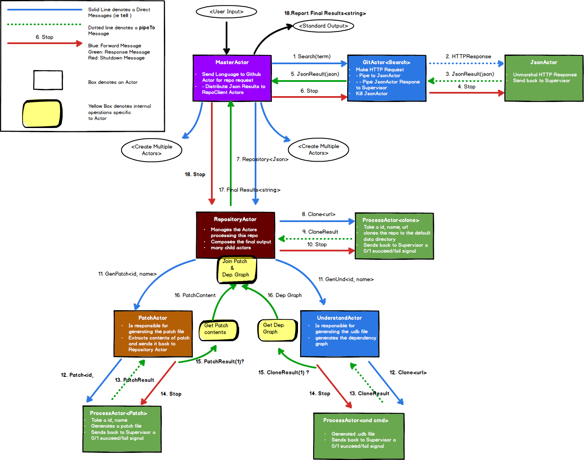

# CS 474: HW3

**Written, developed, tested, and envisioned by Kyle Almryde**
I did this project by myself because all my group members quit the class :-(

Former group member: **Brent Campbell** (No hard feelings, bro!)

#### Preamble

This README documents the installation and usage for the cs474 HW3 tasked with using the [Akka](https://akka.io) and Scala (among others) to do cool stuff. Read on!

### What is this repository for? ###

* Using the [Scala language](http://www.scala-lang.org/), [Akka](https://akka.io) Actor system, [SciTools](https://scitools.com)
Understand API, [GitHub Developer API](https://developer.github.com/), and [jGraphT](https://github.com/jgrapht/jgrapht), this application  extracts repositories of
a user defined language and generates a recommendations to the user in regards to which modules should be tested based on commit history. It generates an Understand Database
and subsequent dependency graph

### Libraries
* [json4s](https://github.com/json4s/json4s) was used to parse JSON like a boss
* [Akka](https://akka.io) was used for the Actor system and HttpRequests
* [SciTools](https://scitools.com) Understand API was used to perform the analysis necessary to generate the dependecy graph
* [jGraphT](https://github.com/jgrapht/jgrapht) was used to produce a dependency graph
* [GitHub Developer API](https://developer.github.com/) was used to query github for open-source projects

### How do I get set up?
To run the application, (assuming you are using Intellij) simply execute the SBT task **'Main'**. You will then be prompted
to enter the name of one of the languages presented to you. If you have trouble entering a valid language name, the program
will simply ask you again until you do (or kill the process by hitting enter)

 **<start the application>**

 **<JVM does some stuff>**

 **----------------------------------------------------------------------------**
 **Hello! From the following list:**
 **ada, assembly, c, c++, c#, fortran, java, jovial, delphi, pascal, pl, m, vhdl, cobol, php, html, css, javascript, python**
 **Please enter Language: \>** *java*

**NOTE: Quotation is not necessary. The application assumes you are passing a string.**

###Full Disclosure
If you have a poor internet connection, you are going to have a bad time. Dont let ComCast get you down!
Joking aside, this app requires a solid internet connection in order to do its job. The app may not shutdown in some cases...

####Setting up from IntelliJ ####

1) If no project is currently open in IntelliJ IDEA, click **Import Project** on the Welcome screen. Otherwise, select **File | New | Project from Existing Sources**.

2) In the dialog that opens, select the directory that contains the project to be imported, or a file that contains an appropriate project description. Click **OK**.

3) On the first page of the **Import Project** wizard, select SBT, and click **Next**. (This page is not shown if IntelliJ IDEA has guessed what you are importing.)

4) On the next page of the wizard, specify SBT project settings and global SBT settings, click **Finish**.

#### Development Testing
For testing purposes, I utilized the latest release, ***version 3.0.5*** and ***version 2.7***

*Be aware, these projects are pretty big and will take some time to parse.

To expedite the development, and to test the functionality of the application and the **Understand API** I used a
handful of very small projects I developed in past courses. Those files are used for the actual Unit Tests proper.

#### Unit Testing
For Unit-testing I utilized Akka's Actor Testkit[ScalaTest](http://www.scalatest.orge) using the [FunSuite](http://doc.scalatest.org/3.0.0/#org.scalatest.FunSuite). Its fun and was surprisingly simple to get it up and running. The Akka Testkit was no walk in the park though, so forgive the stupid simple tests.

Go figure.

To run the tests, in Intellij simplly select the **SBT** task "Test" and youll be up and running! Que sera

## Discussion:
### How to tell something is happening
Keep an eye on the resources directory under **Kyle_Almryde/src/main/resources** a folder named repositories will appear and be populated with cloned repos.

As things progress, you should expect to see a couple of things:
- 1) repository directories are by their **ID/repoName**
-

### Actor Model
I designed the Actor Model in the following way. The basic idea here is that each
step in the pipeline is controlled by and actor. Actions like Invoking the Github
API or generating the Patch and Understand Dependency graph each got their own actor.
My aim was to encapsulate as much of the task within the particular actor as I could
manage. For actions that invoked the system shell I created a separate 'Process Actor'.
For my purposes there was only one Github actor, it performed the query, and piped the results
back to the overseeing master actor, who then distributed the resulting json blobs to a dedicated
repository manager actor. This actor was responsible for overseeing the generation of the Understand database,
Patch file, and eventually composing and joining both of those pieces of information. Finally, it takes this
composition, generates a report, and sends THAT to the Master actor whom is overseeing all of these child
Repository actors, prints the results to Standard output, then shuts down the repository (deleting the contents of
the folder as well). It aint perfect by any measure of the word, but it works **mostly**

### Who do I talk to? ###

* If you have any specific questions contact me via [kyle.almryde@gmail.com](mailto:kyle.almryde@gmail.com)
* If you have any complaints, please direct them to this [Handsome devil](mailto:drmark@uic.edu)

